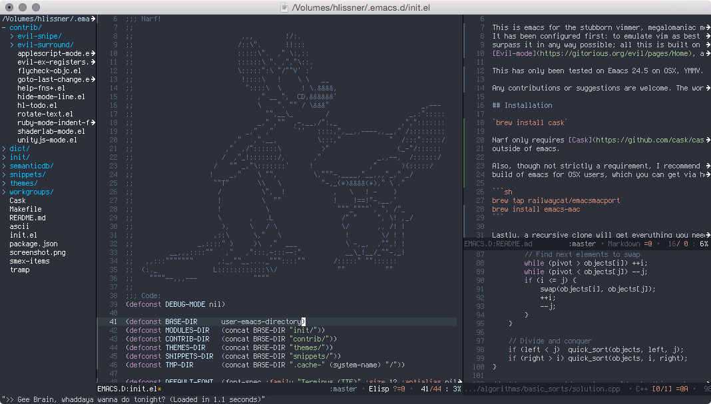
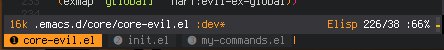
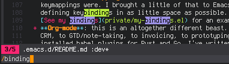
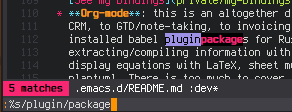
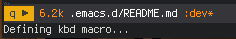
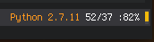

# NARF Emacs



> What we do every night, Pinky...

This is Emacs for stubborn vimmers and megalomaniacal mice alike. Its goals are:
first, to emulate vim as best it can, and second, surpass it in any possible
way. Narf uses [Evil-mode](https://gitorious.org/evil/pages/Home) to emulate
vim, Cask to manage plugins, and a slew of jury-rigged neckbeard shenanigans to
keep my mountain dew cool.

It is tailored for OSX users running Emacs **24.5+**

Any contributions or suggestions are welcome. The world won't take over itself.

## Installation

```
brew install cask
brew install emacs --devel --with-imagemagick --with-librsvg --with-cocoa
git clone --recursive https://github.com/hlissner/emacs.d ~/.emacs.d
cd ~/.emacs.d
make          # installs plugins via cask and generates autoloads
make compile  # optionally byte-compiles everything
```

## Features

To get a picture of what's in NARF check out:

* **[The Caskfile](Cask)**: contains a list of all the installed plugins, and to find where
  they're configured.
* **[init.el](init.el)**: lists all the loaded modules
* **[private/my-bindings.el](private/my-bindings.el)**: most of the custom keybinds
* **[private/my-commands.el](private/my-commands.el)**: available custom ex commands

It's true, I've spent _too much time_ fighting Emacs, trying to make it more vim-like. I'm
just stubborn. Here is a little of what to expect from NARF:

### Basic

  * Modal editing with **evil-mode**
  * Syntax checking with **Flycheck**
  * Completion with **company-mode**
  * Pretty mode-line with **spaceline**
  * Project navigation with **helm** and **neotree**
  * Session persistence (and tab emulation) with **workgroups2**
  * Run code inline with **quickrun**
  * 2-char searching with **evil-snipe**
  * Display diffs in the margin with **git-gutter**
  * Repeat (most) motions with SPC
  * Snippets with **yasnippet**
  * File template support with **auto-insert** and **yasnippet**
  * *writing-mode* for distractions-free typing in any mode
  * Code folding with **hideshow**; doesn't allow arbitrary folds though
  * Multiple region editing with **iedit**
  * O/S interaction functions, like **os-reveal** and **os-open-in-browser**

### Advanced

  * **Popup control with Shackle**: I've gone through lengths tame popups with Shackle
    (popwin was unstable and slow), that includes: Helm, vc-annotate, quickrun, neotree,
    org-mode--and more! It works well. It's not perfect, but it's getting there.
  * **Ex compatibility**: I've given quite a few plugins an Ex interface. For instance,
    `helm-ag` can be used via `:ag [KEYWORDS]`, or `align-regexp` via `:align [regexp]`.
    See [my-commands.el](private/my-commands.el) for others.
    * **Communicating with Tmux**: using `:t [CMD]` (sends to tmux) and `:tcd` (cd's to
      default-directory)
  * **Incremental highlighting for `:g[lobal]`**: evil's stock global command does not do
    this (`:align` will also highlight matches).
  * **iedit instead of multiple-cursors**: I've got my eye on
    [evil-mc](https://github.com/gabesoft/evil-mc), but until I jump ship I use
    **evil-iedit**. To invoke it, hop into visual mode, select a region and press
    <kbd>S-r</kbd> (shift-R). Your edits will apply to all highlighted regions. To limit
    iedit's scope: while in iedit mode go into visual, select a range and press
    <kbd>SPC</kbd>.
  * **Rudimentary support for extra =expand(...) symbols in evil-ex**: this includes
    `%:[pdert]`, which can be used with ex commands like `:e`, `:w`, or in the expression
    register. This *could* be truer to vim, but I haven't gotten around to it.
  * **Vim-esque Omni-completion commands**: I've implemented most of the common
    omni-completion shortcuts:

    ```
    C-x C-l   'narf/company-whole-lines
    C-x C-k   'company-dict
    C-x C-f   'company-files
    C-x C-]   'company-tags
    C-x s     'company-ispell
    C-x C-s   'company-yasnippet
    C-x C-o   'company-semantic
    C-x C-n   'company-dabbrev-code
    C-x C-p   (lambda (interactive)
                (let ((company-selection-wrap-around t))
                  (call-interactively 'company-dabbrev-code)
                  (company-select-previous-or-abort))))
    ```

  * **REPLs via popwin**: currently supports python(ipython), ruby (pry), php (boris),
    elisp (ielm), lua, js (nodejs), and the shell. More support later, hopefully for go
    and rust.
  * **Yasnippet + auto-insert = file-templates with editable fields**: _and_ it works with
    evil-mode! See [core/core-auto-insert.el](core/core-auto-insert.el) for configuration
    details.
  * **Tab emulation with Workgroups2**: Workgroups2 will display the tabs in the
    minibuffer when you press <kbd>⌘-S-T</kbd>, use `:tabs` or move between "tabs". `gt`
    and `gT` work as well.

    

    Also, switch between them with ⌘-1 through ⌘-9.

  * **Minimalistic mapping macro**: I liked how concise mapping keys in viml was. I
    brought a little of that to Emacs by defining `map!`, a macro for defining keybindings
    in as little space as possible. [See my bindings](private/my-bindings.el) for an
    example.
  * **Org-mode**: this is an altogether different beast. I've use Org for everything, from
    CRM, to GTD/note-taking, to invoicing, to prototyping code (with org-babel). I've
    installed babel plugins for Rust and Go. I've written #+CALL methods for
    extracting/compiling information with my CRM org plaintext files. It's set up to
    display equations with LaTeX, sheet music with lilypond, and diagrams with ditaa or
    plantuml. There is too much to cover in only one paragraph, and it's constantly
    evolving.
  * **Modeline improvements**
    * **evil-search/iedit/evil-substitute mode-line integration**: I like how anzu
      displays state about the current search in the mode-line, so I wrote mode-line
      segments to display matches for evil-search (e.g. `/`/`?` searches), evil-substitute
      (e.g. `%s/foo/bar`) and iedit.

      
      
    * **Macro-recording indicator**: Displays an indicator that you are recording a macro
      (and what register it's being recorded into).

      
    * **Show (py|rb)env version in mode-line**: see `define-env-command` on how to set it up
      for other modes. It only displays in their respective major-modes.

      


## What about Windo-

