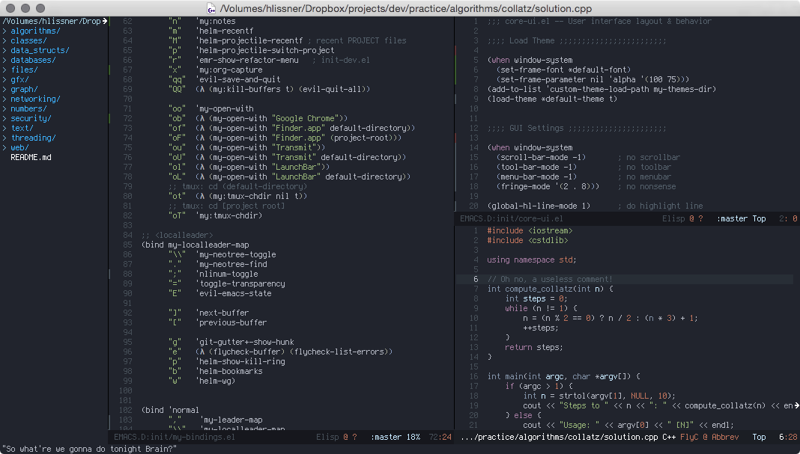

# My emacs.d



> What we do every night, Pinky...

This is emacs for the stubborn vimmer, and then some.

This distro is primarily for Emacs 24.5+ users on OSX, but should work for
debian derivative linux distros.

## Installation

```sh
brew tap railwaycat/emacsmacport
brew install emacs-mac --cocoa --with-imagemagick --with-gnutls
brew install cask
git clone --recursive https://github.com/hlissner/emacs.d ~/.emacs.d
cd ~/.emacs.d
make
```

## Customization

See:

```
./Cask                   # for packages in this distro
./init/my-commands.el    # for all custom ex commands
./init/my-bindings.el    # for all keybindings
./init/init-*.el         # for all package settings
```

## What about Windo-

